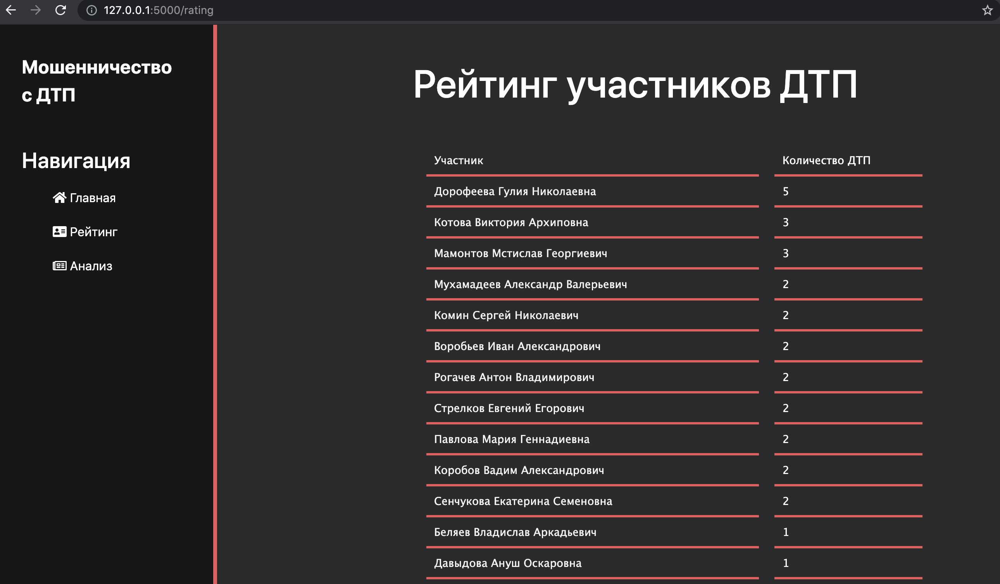
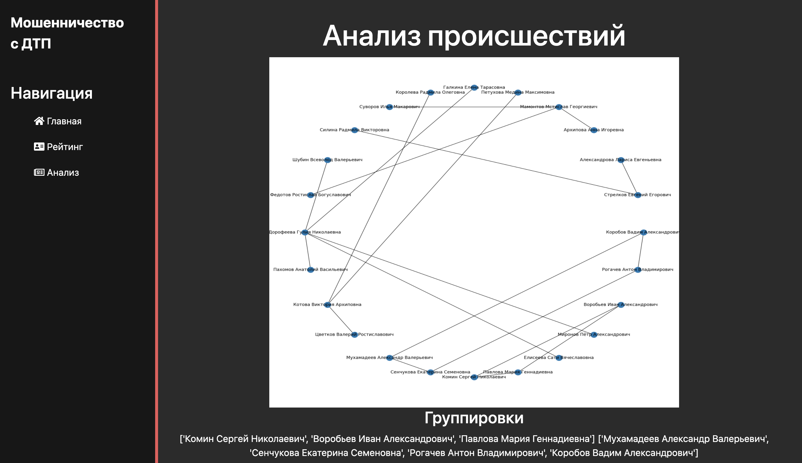

Необходимо выбрать одну задачу для реализации, сделать сервинг модели машинного обучения с помощью какого-либо фреймворка, собрать контейнер.

Задание 2
Проанализировать выборку сьраховых событий (ДТП с 2-мя участниками) на возможное мошенничество. Выделить клиентов, относительно которых существует подозрение на мошеннические действия.

1. Вывод рейтинга участников ДТП (сколько раз человек был участником ДТП)

2. Построение графа связности участников ДТП и выявление мошеннических группировок

